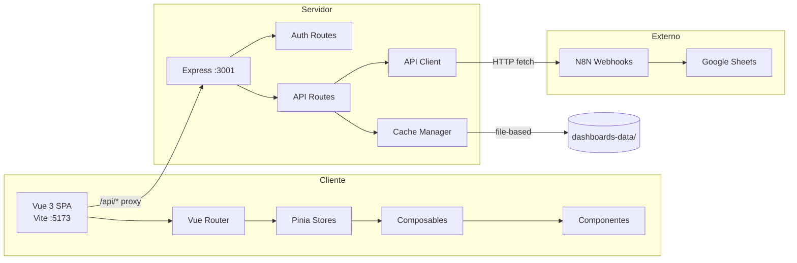
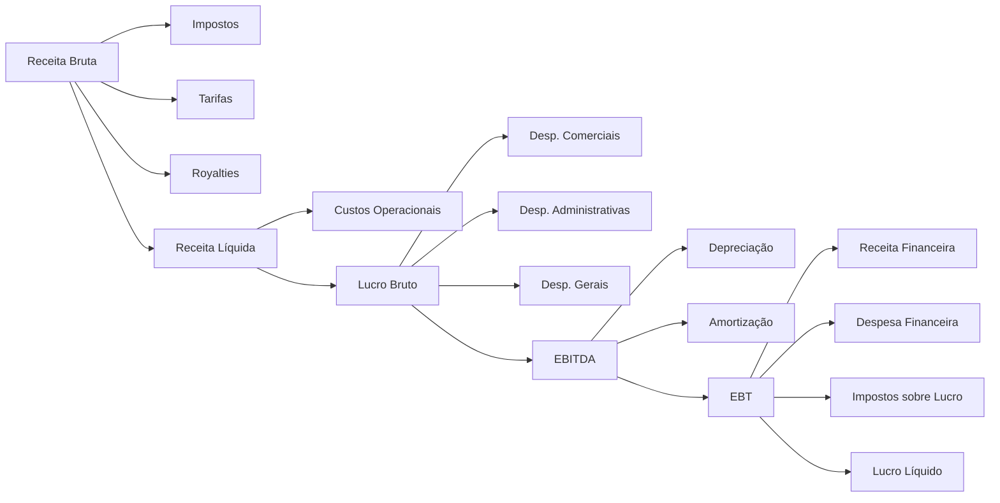
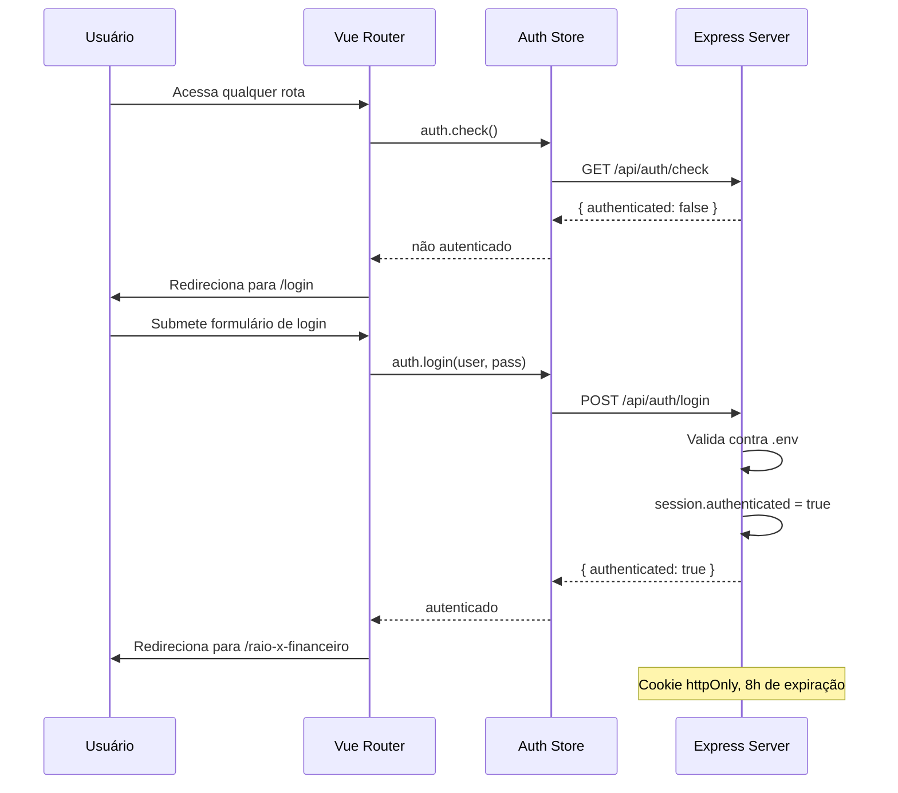
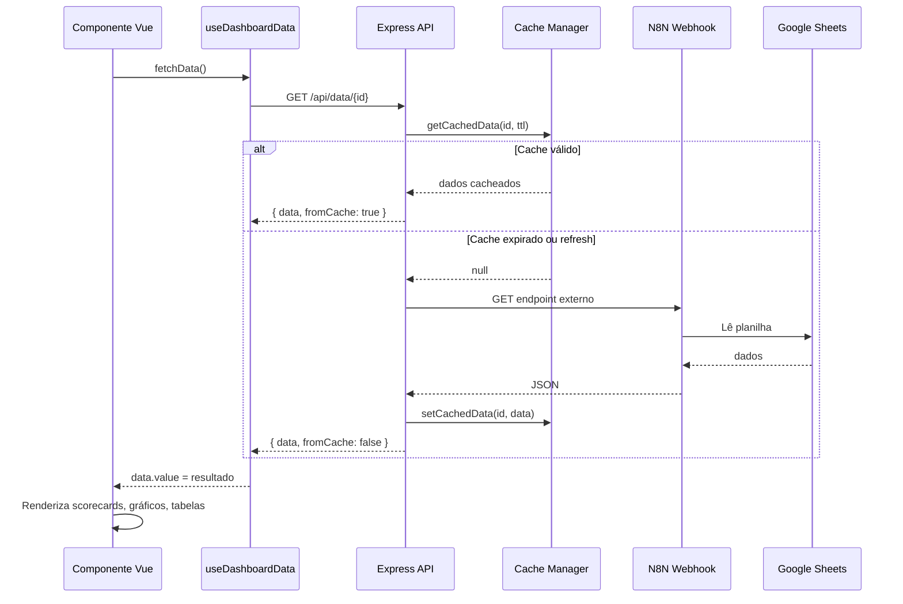
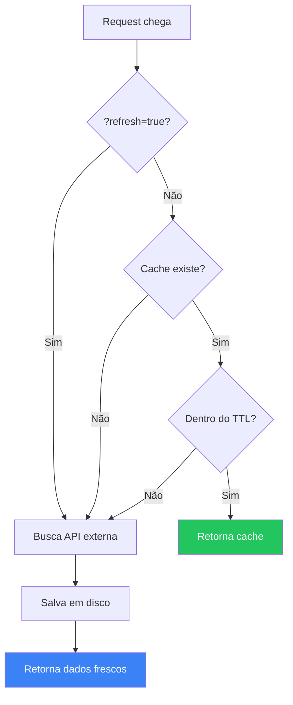

# Documentação Completa — Dashboards V4

> [!abstract] Visão Geral
> Aplicação SPA centralizada de dashboards da **V4 Company**, construída com Vue 3 + Vite no frontend e Express.js no backend. Inclui sistema de cache inteligente, autenticação por sessão, e componentes reutilizáveis. Toda a UI é em **português (pt-BR)**.

---

## Índice

- [[#1. Arquitetura Geral]]
- [[#2. Stack Tecnológica]]
- [[#3. Estrutura de Diretórios]]
- [[#4. Backend (Express)]]
  - [[#4.1 Servidor Principal]]
  - [[#4.2 Rotas de Autenticação]]
  - [[#4.3 Rotas de API]]
  - [[#4.4 Middleware de Autenticação]]
  - [[#4.5 Cliente HTTP (api-client)]]
  - [[#4.6 Gerenciador de Cache]]
- [[#5. Frontend (Vue 3)]]
  - [[#5.1 Inicialização (main.js)]]
  - [[#5.2 Componente Raiz (App.vue)]]
  - [[#5.3 Router]]
  - [[#5.4 Stores (Pinia)]]
  - [[#5.5 Composables]]
  - [[#5.6 Componentes Reutilizáveis]]
- [[#6. Dashboards]]
  - [[#6.1 GTM Motion]]
  - [[#6.2 Taxa de Conversão Saber → Monetização]]
  - [[#6.3 Marketing e Vendas]]
  - [[#6.4 Raio-X Financeiro (DRE / Fluxo de Caixa)]]
- [[#7. Design System]]
- [[#8. Fluxos de Dados]]
  - [[#8.1 Fluxo de Autenticação]]
  - [[#8.2 Fluxo de Carregamento de Dados]]
  - [[#8.3 Fluxo de Cache]]
- [[#9. Configuração e Deploy]]
- [[#10. Guia de Criação de Novo Dashboard]]
- [[#11. Gotchas e Armadilhas]]

---

## 1. Arquitetura Geral



O sistema funciona como um **proxy inteligente com cache**: o Express recebe as requisições do Vue, verifica o cache local em disco, e caso expirado, busca dados frescos das APIs externas (N8N webhooks que conectam ao Google Sheets). O frontend consome os dados já formatados e os exibe em scorecards, gráficos e tabelas.

---

## 2. Stack Tecnológica

| Camada | Tecnologia | Versão | Propósito |
|--------|-----------|--------|-----------|
| Frontend | Vue 3 | ^3.4.21 | Framework reativo de UI |
| Roteamento | Vue Router | ^4.3.0 | Navegação SPA |
| Estado | Pinia | ^2.1.7 | Gerenciamento de estado global |
| Build | Vite | - | Bundler com HMR < 100ms |
| Backend | Express | ^4.18.3 | API server e proxy |
| Sessão | express-session | ^1.19.0 | Autenticação por cookie httpOnly |
| HTTP Client | node-fetch | ^3.3.2 | Chamadas a APIs externas (ESM) |
| Gráficos | Chart.js | 4.4.1 | Barras, linhas, datalabels (CDN) |
| Sankey | ECharts | 5.5.0 | Diagrama Sankey financeiro (CDN) |
| Ícones | Lucide Icons | latest | Ícones SVG (CDN) |
| Fonte | Ubuntu | Google Fonts | Tipografia principal |

---

## 3. Estrutura de Diretórios

```
dashboards-v4/
├── client/                          # Frontend Vue 3
│   ├── index.html                   # Entry point (CDN libs, fonts, CSS)
│   ├── main.js                      # Bootstrap Vue + Pinia + Router
│   ├── App.vue                      # Root (layout condicional login vs dashboard)
│   ├── router/index.js              # Rotas auto-geradas de dashboards.json
│   ├── stores/
│   │   ├── auth.js                  # Store de autenticação (check/login/logout)
│   │   └── dashboardData.js         # Store de dados (cache em memória + loading)
│   ├── composables/
│   │   ├── useDashboardData.js      # Fetch com retry e redirect em 401
│   │   ├── useFormatters.js         # Formatadores pt-BR (moeda, %, data)
│   │   └── useChartDefaults.js      # Config padrão Chart.js + paleta
│   ├── components/
│   │   ├── layout/
│   │   │   ├── VLayout.vue          # Wrapper principal (sidebar + content + modal)
│   │   │   └── VSidebar.vue         # Navegação lateral com status dots
│   │   ├── ui/
│   │   │   ├── VScorecard.vue       # Card de KPI com trend
│   │   │   ├── VDataTable.vue       # Tabela de dados genérica
│   │   │   ├── VToggleGroup.vue     # Grupo de botões toggle (v-model)
│   │   │   ├── VRefreshButton.vue   # Botão atualizar com spinner
│   │   │   └── VStatusModal.vue     # Modal de status (dev/manutenção)
│   │   └── charts/
│   │       ├── VChartCard.vue       # Wrapper de gráfico (título + loading)
│   │       ├── VBarChart.vue        # Gráfico de barras (stacked/horizontal)
│   │       └── VLineChart.vue       # Gráfico de linhas (gradient/area)
│   ├── styles/
│   │   ├── design-system.css        # Variáveis CSS, cores, tipografia
│   │   ├── components.css           # Estilos de cards, botões, tabelas, inputs
│   │   └── layout.css               # Sidebar, main content, responsivo
│   ├── views/
│   │   ├── LoginView.vue            # Página de login (standalone, sem layout)
│   │   └── NotFound.vue             # Página 404
│   └── dashboards/
│       ├── GtmMotion/               # Dashboard funil comercial
│       ├── TxConvSaberMonetizacao/  # Dashboard conversão por safra/tier
│       ├── MarketingVendas/         # Dashboard MKT+Vendas por tier/analista/canal
│       └── DreFluxoCaixa/           # Dashboard financeiro (Sankey)
├── server/
│   ├── index.js                     # Express app (sessão, rotas, static)
│   ├── lib/
│   │   ├── api-client.js            # fetchData + fetchDataWithRetry
│   │   └── cache-manager.js         # getCachedData, setCachedData, getCacheStatus
│   ├── middleware/
│   │   └── requireAuth.js           # Guard: 401 se não autenticado
│   └── routes/
│       ├── api.js                   # /api/dashboards, /api/data/:id, trigger-update
│       └── auth.js                  # /api/auth/login, logout, check
├── config/
│   └── dashboards.json              # Registry de dashboards (id, título, endpoint, TTL, status)
├── dashboards-data/                 # Cache em disco (gitignored)
│   └── {dashboardId}/cache.json
├── .env                             # Variáveis de ambiente (credenciais, endpoints)
├── .env.example                     # Template do .env
├── design-system.md                 # Especificação visual completa
├── package.json                     # Dependências e scripts
└── vite.config.js                   # Proxy, build, aliases
```

---

## 4. Backend (Express)

### 4.1 Servidor Principal

**Arquivo:** `server/index.js`

O servidor Express configura:
- **Sessão**: `express-session` com `session-file-store` (dev) ou in-memory, cookie httpOnly com expiração de **8 horas**
- **CORS/Proxy**: Em dev, o Vite faz proxy de `/api` para `:3001`
- **Rotas abertas**: `/api/auth/*`, `/health`
- **Rotas protegidas**: `/api/dashboards`, `/api/data/*`, `/api/cache/*` — via `requireAuth`
- **Produção**: Serve arquivos estáticos de `dist/client/` com fallback SPA

### 4.2 Rotas de Autenticação

**Arquivo:** `server/routes/auth.js`

| Método | Rota | Descrição |
|--------|------|-----------|
| `POST` | `/api/auth/login` | Recebe `{ username, password }`, valida contra `.env`, seta `session.authenticated = true` |
| `POST` | `/api/auth/logout` | Destroi sessão e limpa cookie |
| `GET` | `/api/auth/check` | Retorna `{ authenticated: true/false }` (sem auth requerida) |

**Credenciais**: Definidas em `.env` como `USER_NAME` e `USER_PASSWORD`.

### 4.3 Rotas de API

**Arquivo:** `server/routes/api.js`

#### `GET /api/dashboards`
Retorna a lista de dashboards registrados em `config/dashboards.json`, filtrando campos sensíveis. Response:
```json
{
  "dashboards": [
    { "id": "gtm-motion", "title": "GTM Motion", "icon": "activity", "status": "available" }
  ]
}
```

#### `GET /api/data/:dashboardId`
Busca dados de um dashboard com cache inteligente:

1. Localiza config do dashboard em `dashboards.json`
2. Resolve endpoint da API via `process.env[apiEndpoint]`
3. Gera cache key: `${dashboardId}--${queryParams}`
4. Se cache válido (dentro do TTL) e sem `?refresh=true` → retorna cache
5. Caso contrário → fetch na API externa → salva em cache → retorna

**Response:**
```json
{
  "data": { /* dados do dashboard */ },
  "fromCache": true,
  "timestamp": "2026-04-07T12:00:00.000Z"
}
```

#### `GET /api/gtm-motion/trigger-update`
#### `GET /api/marketing-vendas/trigger-update`
Dispara webhook N8N para atualizar dados na planilha antes do refresh. POST com timeout de 5 minutos.

#### `GET /api/cache/status/:dashboardId`
Retorna metadados do cache: existe, válido, idade, tempo até expiração.

### 4.4 Middleware de Autenticação

**Arquivo:** `server/middleware/requireAuth.js`

```javascript
// Bloqueia acesso sem sessão autenticada
if (req.session?.authenticated) return next()
res.status(401).json({ error: 'Não autenticado' })
```

### 4.5 Cliente HTTP (api-client)

**Arquivo:** `server/lib/api-client.js`

| Função | Descrição |
|--------|-----------|
| `fetchData(endpoint, options)` | Fetch com `AbortController` (timeout 5min), headers JSON, log de bytes |
| `fetchDataWithRetry(endpoint, options)` | Wrapper com retry (N tentativas, delay configurável, skip em 4xx) |

### 4.6 Gerenciador de Cache

**Arquivo:** `server/lib/cache-manager.js`

Cache file-based em `dashboards-data/{dashboardId}/cache.json`:

```json
{
  "timestamp": 1712444444000,
  "data": { /* dados */ }
}
```

| Função | Descrição |
|--------|-----------|
| `getCachedData(dashboardId, ttl)` | Lê cache do disco, valida TTL, retorna `null` se expirado |
| `setCachedData(dashboardId, data)` | Salva dados com timestamp, cria diretório se necessário |
| `getCacheStatus(dashboardId, ttl)` | Retorna objeto com `exists`, `valid`, `age`, `expiresIn` |

**TTL padrão:** 5 minutos (300.000ms), configurável por dashboard em `dashboards.json`.

---

## 5. Frontend (Vue 3)

### 5.1 Inicialização (main.js)

**Arquivo:** `client/main.js`

Bootstrap da aplicação:
1. Cria app Vue com `createApp(App)`
2. Instala Pinia (state management)
3. Instala Vue Router
4. Monta em `#app`
5. Registra Chart.js datalabels plugin (desabilitado por padrão)
6. Inicializa Lucide Icons

### 5.2 Componente Raiz (App.vue)

**Arquivo:** `client/App.vue`

Renderização condicional:
- **Rota `/login`**: Renderiza `<router-view>` diretamente (sem layout, sem sidebar)
- **Demais rotas**: Renderiza `<VLayout>` com sidebar + `<router-view>` com transição fade

Carrega lista de dashboards via `GET /api/dashboards` quando o usuário sai da tela de login (watch em `route.name`).

### 5.3 Router

**Arquivo:** `client/router/index.js`

**Geração dinâmica de rotas**: Lê `config/dashboards.json` em build-time e gera uma rota para cada dashboard:
```
/{dashboard.id} → lazy import de ../dashboards/{componentPath}/index.vue
```

**Rotas fixas:**
| Rota | Componente | Descrição |
|------|-----------|-----------|
| `/login` | `LoginView` | Autenticação |
| `/` | redirect | Redireciona para `/raio-x-financeiro` |
| `/:pathMatch(.*)` | `NotFound` | 404 |

**Guard global (`beforeEach`):**
1. Se rota é `/login` → permite
2. Chama `auth.check()` → verifica sessão no servidor
3. Se não autenticado → redireciona para `/login`
4. Atualiza `document.title` com `meta.title`

### 5.4 Stores (Pinia)

#### Auth Store (`stores/auth.js`)

| Propriedade/Método | Tipo | Descrição |
|--------------------|------|-----------|
| `authenticated` | `ref(false)` | Estado de autenticação |
| `check()` | async | `GET /api/auth/check` → atualiza `authenticated` |
| `login(user, pass)` | async | `POST /api/auth/login` → seta `authenticated = true` |
| `logout()` | async | `POST /api/auth/logout` → seta `authenticated = false` |

#### Dashboard Data Store (`stores/dashboardData.js`)

| Propriedade/Método | Tipo | Descrição |
|--------------------|------|-----------|
| `getData(id)` | computed | Retorna dados cacheados do dashboard |
| `isLoading(id)` | computed | Estado de loading por dashboard |
| `getError(id)` | computed | Mensagem de erro por dashboard |
| `isFromCache(id)` | computed | Se dados vieram do cache |
| `fetchData(id, force)` | async | Busca dados, armazena no store |
| `getCacheMetadata(id)` | function | Retorna `{ fromCache, timestamp, age, ageMinutes }` |

### 5.5 Composables

#### `useDashboardData(dashboardId)`

**Arquivo:** `client/composables/useDashboardData.js`

Composable principal para fetch de dados em dashboards individuais.

**Retorna:**
```javascript
{
  data,        // ref — dados do dashboard
  loading,     // ref — estado de loading
  error,       // ref — mensagem de erro
  fromCache,   // ref — se veio do cache
  hasData,     // computed — data !== null
  fetchData    // (forceRefresh?, params?) → Promise
}
```

**Comportamento do `fetchData`:**
- Retry automático: 1 tentativa extra com delay de 1.5s
- Erros retryáveis: resposta vazia, JSON inválido, erro de rede
- HTTP 401 → `window.location.href = '/login'`
- Parâmetros extras são encaminhados como query string para a API

#### `useFormatters()`

**Arquivo:** `client/composables/useFormatters.js`

Formatadores em locale `pt-BR`:

| Função | Exemplo Input | Exemplo Output |
|--------|--------------|----------------|
| `formatNumber(1234.5, 2)` | `1234.5` | `"1.234,50"` |
| `formatPercentage(0.456)` | `0.456` | `"45,60%"` |
| `formatCurrency(1000)` | `1000` | `"R$ 1.000,00"` |
| `formatCurrencyAbbrev(1500000)` | `1500000` | `"R$ 1,5M"` |
| `formatDateTime(iso, true)` | ISO string | `"24/02/2026 18:07"` |
| `formatRelativeTime(date)` | Date | `"2 horas atrás"` |
| `truncate(text, 50)` | long string | `"Lorem ipsum dolor sit..."` |
| `formatBytes(1024)` | `1024` | `"1.00 KB"` |

#### `useChartDefaults()`

**Arquivo:** `client/composables/useChartDefaults.js`

| Função | Descrição |
|--------|-----------|
| `getChartDefaults(overrides)` | Retorna config Chart.js completa com design system (deep merge) |
| `getChartColors()` | Array de 8 cores para datasets |
| `getSemanticColors()` | Objeto `{ safe, care, danger, info, primary, neutral }` |
| `createGradient(ctx, color, height)` | Gradiente linear para preenchimento de line charts |

### 5.6 Componentes Reutilizáveis

#### Layout

##### `VLayout.vue`
**Props:** `dashboards: Array` (required)
**Slots:** default (conteúdo principal)

Wrapper da aplicação que gerencia:
- Sidebar responsiva (colapsa em mobile ≤768px com overlay)
- Status modal automático para dashboards em `development` ou `maintenance`
- Reinicialização de Lucide Icons em mudanças de rota

##### `VSidebar.vue`
**Props:** `dashboards: Array`, `collapsed: Boolean`
**Emits:** `toggle`

Navegação lateral fixa (240px):
- Links gerados via `<router-link>` para cada dashboard
- Status dots coloridos com glow:
  - ==Verde== → `available` (disponível)
  - ==Amarelo== → `development` (em desenvolvimento)
  - ==Vermelho== → `maintenance` (em manutenção)

#### UI

##### `VScorecard.vue`
**Props:** `label`, `value`, `icon?`, `loading?`, `formatter?`, `trend?`, `trendDirection?`

Card de KPI com:
- Ícone Lucide opcional
- Valor formatado via `formatter`
- Indicador de tendência (↑ verde / ↓ vermelho / — neutro)

##### `VDataTable.vue`
**Props:** `columns: Array<{ key, label, align?, bold?, formatter? }>`, `rows: Array`, `loading?`

Tabela de dados:
- Formatação customizada por coluna
- Alinhamento configurável
- Estado vazio: "Nenhum dado disponível"
- Valor fallback: `"-"` para null/undefined

##### `VToggleGroup.vue`
**Props:** `options: Array<{ value, label }>`, `modelValue`
**Emits:** `update:modelValue` (v-model)

Grupo de botões toggle com estado ativo em vermelho (#ff0000) e efeito glow.

##### `VRefreshButton.vue`
**Props:** `loading?`
**Emits:** `click`

Botão "Atualizar" / "Atualizando..." com ícone spinner.

##### `VStatusModal.vue`
**Props:** `visible`, `status`, `dashboardTitle`, `message`
**Emits:** `close`

Modal de status com borda superior colorida (laranja para dev, vermelho para manutenção), backdrop com blur, botão "Entendido".

#### Charts

##### `VChartCard.vue`
**Props:** `title`, `loading?`
**Slots:** default (canvas do gráfico), `#actions` (botões)

Wrapper card para gráficos com header e estado de loading.

##### `VBarChart.vue`
**Props:** `labels`, `datasets`, `stacked?`, `datalabels?`, `horizontal?`, `options?`, `customPlugins?`

Gráfico de barras Chart.js com:
- Cores padrão automáticas se não fornecidas
- Stacking opcional
- Modo horizontal (`indexAxis: 'y'`)
- Data labels configuráveis
- Border radius de 4px nos bars

##### `VLineChart.vue`
**Props:** `labels`, `data`, `label?`, `color?`, `gradient?`, `options?`, `datalabels?`

Gráfico de linhas Chart.js com:
- Curva suave (tension 0.4)
- Preenchimento com gradiente opcional
- Pontos com borda branca
- Data labels posicionados acima

---

## 6. Dashboards

### 6.1 GTM Motion

> [!info] Produção Comercial
> Dashboard principal de funil de vendas, mostrando a jornada de leads desde a captação até o booking, segmentado por canal, tier e step.

**Diretório:** `client/dashboards/GtmMotion/`
**Rota:** `/gtm-motion`
**API Endpoint:** `API_ENDPOINT_GTM_MOTION` (.env)

#### Fontes de Dados

A API retorna duas abas da planilha Google Sheets via N8N:

| Aba | Campos | Propósito |
|-----|--------|-----------|
| **KPIs** | `canal, mes, leads_value, mql_value, sql_value, sal_value, commit_value, avg_ticket, booking` | KPIs agregados por canal/mês |
| **Funil** | `canal, mes, tier, subcategoria, leads, mql, sql, sal, commit, booking` | Breakdown por tier com subcategorias |

#### O que exibe

**7 Scorecards de KPI:**
- Leads, MQL, SQL, SAL, Commit, Avg Ticket, Booking
- Cada um mostra: valor real, provisionado, meta, e delta % (atingimento)
- Cores do delta: ==verde== (≥100%), ==amarelo== (80-99%), ==vermelho== (<80%)

**Tabela de Funil Expansível (GtmFunnelTable):**
- 13 colunas com taxas de conversão (CR1→CR4)
- Breakdown por tier: Enterprise, Large, Medium, Small, Tiny, Non-ICP, Sem mapeamento
- Cada tier expande para mostrar steps (Saber, Ter, Executar, Potencializar)
- CRs coloridos com thresholds

**Filtros:**
- Período (mês inicial → mês final) com detecção de Q1
- Canal: single-select (Consolidado ou canal específico)
- Closer e SDR: computados dinamicamente a partir dos dados

**Seções Integradas:**
- Tabelas MvSectionTable para visões por Analista e Canal
- Tabela MvListagemTable para listagem de leads

**Componentes Específicos:**
- `GtmScorecard.vue` — Scorecard com meta, provisionado e delta colorido
- `GtmFunnelTable.vue` — Tabela complexa com rows expansíveis via Set

> [!tip] Mock Data
> Acesse `/gtm-motion?mock-data` para forçar dados mock com tiers completos, útil quando a API não retorna breakdown por tier.

---

### 6.2 Taxa de Conversão Saber → Monetização

> [!info] Conversão por Safra
> Analisa a conversão de clientes da categoria "Saber" para "Ter" ou "Executar" (monetização), segmentado por safra (cohort mensal) e tier.

**Diretório:** `client/dashboards/TxConvSaberMonetizacao/`
**Rota:** `/tx-conv-saber-monetizacao`
**API Endpoint:** `API_ENDPOINT_CONV_SABER_MONETIZACAO` (.env)

#### Fontes de Dados

```javascript
// API retorna:
{
  data: {
    leads_saber: [{ lead_id, company_id, lead_created_at_safra, lead_tier }],
    leads_monetizacao: [{ lead_id, company_id }]  // company_id = monetizado
  }
}
```

**Lógica chave:** Deduplica por `company_id` única por safra/tier. Taxa = empresas monetizadas únicas / total leads Saber.

#### O que exibe

**3 Scorecards:**
- Total de clientes Saber
- Clientes monetizados (company_id únicos)
- Taxa média de conversão

**Gráfico por Safra (SafraChart):**
- Barras empilhadas: monetizados vs. não monetizados
- Data labels com taxa de conversão (%)
- Tooltip com breakdown detalhado

**Gráfico por Tier (TierChart) — 2 visões:**

| Visão | Tipo | Descrição |
|-------|------|-----------|
| Consolidado | Barras horizontais | Ordenado por taxa de conversão (desc), cores fixas por tier |
| Por Safra | Barras verticais | Agrupado por mês, com separadores visuais (linhas sólidas para ano, tracejadas para mês) |

**Paleta fixa de tiers:**
- Enterprise → verde
- Large → laranja
- Medium → amarelo
- Small → vermelho
- Tiny → roxo
- Sem Tier → cinza

**2 Tabelas detalhadas:**
- Consolidada: Safra | Total | Monetizados | % Conversão
- Por Tier: Safra | Tier | Total | Monetizados | % Conversão

---

### 6.3 Marketing e Vendas

> [!info] Performance MKT + Vendas
> Dashboard de performance de marketing e vendas com métricas por tier, analista e canal de origem.

**Diretório:** `client/dashboards/MarketingVendas/`
**Rota:** `/marketing-vendas`
**API Endpoint:** `API_ENDPOINT_MARKETING_VENDAS` (.env)

#### O que exibe

**3 Tabelas de Seção (MvSectionTable):**

| Seção | Agrupamento | Visual |
|-------|-------------|--------|
| Por Tier | Enterprise, Large, Medium, Small, Tiny | Nome em texto |
| Por Analista | 4 analistas (GE, GU, LU, GS) | Avatar com iniciais |
| Por Canal | Lead Broker, Black Box, Eventos, Outros | Ícone Lucide + cor |

**Métricas em cada seção (8 colunas):**
- Investimento (com trend ↑↓ %)
- Prospects
- Leads
- Reuniões Agendadas
- Reuniões Realizadas
- Contratos
- R$ Booking
- Avg. Ticket (com status dot: verde/amarelo/laranja/vermelho)

**Tabela de Listagem (MvListagemTable):**

| Feature | Descrição |
|---------|-----------|
| Busca | Por nome do lead |
| Ordenação | Multi-coluna com indicadores visuais |
| Paginação | 10, 25, 50, 100 por página |
| Colunas | Nome, Data Criação, Tier (badge colorido), Categoria/Step, Canal, Etapa, Link Kommo |
| Links | Abre Kommo (CRM) em nova aba |

**Componentes Específicos:**
- `MvSectionTable.vue` — Tabela com trend, avatares, ícones, status dots, skeleton loading
- `MvListagemTable.vue` — Tabela com busca, sort, paginação, badges de tier

---

### 6.4 Raio-X Financeiro (DRE / Fluxo de Caixa)

> [!info] Visão Financeira
> Diagrama de Sankey que visualiza o fluxo financeiro da empresa desde receita bruta até lucro líquido, com 4 perspectivas diferentes.

**Diretório:** `client/dashboards/DreFluxoCaixa/`
**Rota:** `/raio-x-financeiro` (rota padrão após login)
**API Endpoint:** `API_ENDPOINT_DIAGRAMA_SANKEY` (.env)

#### 4 Perspectivas (Views)

| View | Descrição |
|------|-----------|
| Planejado | Orçamento planejado |
| Competência (DRE) | Regime de competência |
| Caixa Realizado | Fluxo de caixa efetivo |
| Caixa Previsto | Projeção de caixa |

#### O que exibe

**Cards Executivos:**
- Receita Líquida
- Lucro Bruto (com badge % da receita)
- EBITDA (com badge %)
- Lucro Líquido (com badge %)

**Cores dos badges:**
| Métrica | Vermelho | Amarelo | Verde |
|---------|----------|---------|-------|
| Lucro Bruto | <50% | 50-60% | >60% |
| EBITDA | <20% | 20-25% | >25% |
| Lucro Líquido | <10% | 10-15% | >15% |

**Pills de Despesa:**
5 indicadores mostrando % da receita + valor absoluto:
- % Custo Operacional (baseline 29,36%)
- % Desp. Comerciais (baseline 24,39%)
- % Desp. Administrativas (baseline 18,90%)
- % Desp. Gerais (baseline 6,03%)
- % Despesa Financeira (baseline 3,00%)

**Diagrama Sankey (ECharts):**



**Características do Sankey:**
- 18 nós com fluxo multi-camada
- ==Verde== para fluxos positivos (pipeline principal)
- ==Vermelho== para deduções e valores negativos
- Nós mudam de cor para vermelho quando o valor é negativo
- Tooltip mostra: valor real, % da Receita Bruta, % da Receita Líquida
- Curveness 0.7, responsive resize

**Componente Específico:**
- `DreSankeyChart.vue` — Gerencia ECharts com valores negativos (armazena `realValue` separado do `value` de layout)

---

## 7. Design System

> [!note] Referência Completa
> Ver `design-system.md` na raiz do projeto para a especificação visual completa.

### Cores

**Fundos (escuro → claro):**
| Token | Valor | Uso |
|-------|-------|-----|
| `--bg-body` | `#0d0d0d` | Fundo da página |
| `--bg-card` | `#141414` | Cards e sidebar |
| `--bg-inner` | `#1a1a1a` | Áreas internas, hovers |

**Texto (claro → escuro):**
| Token | Valor | Uso |
|-------|-------|-----|
| `--text-high` | `#ffffff` | Títulos, valores importantes |
| `--text-medium` | `#cccccc` | Texto principal |
| `--text-low` | `#999999` | Texto secundário |
| `--text-muted` | `#888888` | Labels |
| `--text-lowest` | `#666666` | Headers de tabela |

**Semânticas:**
| Token | Valor | Uso |
|-------|-------|-----|
| `--color-primary` | `#ff0000` | Vermelho V4, CTAs, ativo |
| `--color-safe` | `#22c55e` | Sucesso, positivo |
| `--color-care` | `#fbbf24` | Atenção, warning |
| `--color-danger` | `#ef4444` | Erro, negativo |
| `--color-info` | `#3b82f6` | Informação |

### Tipografia

- **Fonte:** Ubuntu (Google Fonts), fallback Segoe UI
- **Tamanhos:** 10px (xs) → 48px (kpi)
- **Pesos:** 400 (normal) → 800 (extrabold)

### Espaçamento

| Token | Valor |
|-------|-------|
| `--spacing-xs` | 4px |
| `--spacing-sm` | 8px |
| `--spacing-md` | 15px |
| `--spacing-lg` | 20px |
| `--spacing-xl` | 25px |

### Border Radius

| Token | Valor |
|-------|-------|
| `--radius-sm` | 4px |
| `--radius-md` | 6px |
| `--radius-lg` | 12px |
| `--radius-round` | 50% |

### Paleta de Gráficos

> [!warning] Sem azul como cor primária de gráficos
> A paleta evita azul como cor dominante. Cores principais: Verde, Laranja, Amarelo, Vermelho, Roxo, Verde-limão, Rosa, Cinza.

---

## 8. Fluxos de Dados

### 8.1 Fluxo de Autenticação



### 8.2 Fluxo de Carregamento de Dados



### 8.3 Fluxo de Cache



---

## 9. Configuração e Deploy

### Variáveis de Ambiente (.env)

```bash
# Server
NODE_ENV=production          # ou development
PORT=3000                    # Porta do Express (dev: 3001)

# Autenticação
USER_NAME=seu_usuario
USER_PASSWORD=sua_senha
SESSION_SECRET=string_aleatoria_longa

# Endpoints N8N (webhooks)
API_ENDPOINT_CONV_SABER_MONETIZACAO=https://n8n.example.com/webhook/...
API_ENDPOINT_GTM_MOTION=https://n8n.example.com/webhook/...
API_ENDPOINT_MARKETING_VENDAS=https://n8n.example.com/webhook/...
API_ENDPOINT_DIAGRAMA_SANKEY=https://n8n.example.com/webhook/...
```

### Scripts

| Comando | Descrição |
|---------|-----------|
| `npm install` | Instala dependências |
| `npm run dev` | Dev: Vite (:5173) + Express (:3001) em paralelo |
| `npm run build` | Build de produção → `dist/client/` |
| `npm run preview` | Preview do build |
| `npm start` | Servidor de produção (Express serve static) |

### URLs

| Ambiente | URL |
|----------|-----|
| Dev Frontend | `http://localhost:5173` |
| Dev Backend | `http://localhost:3001` |
| Produção | `http://localhost:{PORT}` |
| Health Check | `GET /health` |

### Deploy em Produção

1. `npm install --production`
2. `npm run build`
3. Configurar `.env` com credenciais e endpoints reais
4. `NODE_ENV=production npm start`
5. Express serve SPA de `dist/client/` com fallback para `index.html`

---

## 10. Guia de Criação de Novo Dashboard

### Passo a Passo

**1. Criar estrutura de diretórios:**
```bash
mkdir -p client/dashboards/MeuDashboard/components
```

**2. Criar `config.js`:**
```javascript
export default {
  id: 'meu-dashboard',
  title: 'Meu Dashboard',
  icon: 'bar-chart',          // Nome do ícone Lucide
  description: 'Descrição breve'
}
```

**3. Criar `index.vue`:**
```vue
<script setup>
import { onMounted } from 'vue'
import { useDashboardData } from '@/composables/useDashboardData'
import { useFormatters } from '@/composables/useFormatters'
import VRefreshButton from '@/components/ui/VRefreshButton.vue'
import VScorecard from '@/components/ui/VScorecard.vue'

const { data, loading, error, fetchData } = useDashboardData('meu-dashboard')
const { formatNumber, formatCurrency } = useFormatters()

onMounted(() => fetchData())
</script>

<template>
  <div class="dashboard-container">
    <header class="dashboard-header">
      <h1>Meu Dashboard</h1>
      <VRefreshButton :loading="loading" @click="fetchData(true)" />
    </header>

    <div class="scorecard-grid">
      <VScorecard label="Métrica 1" :value="data?.metrica1" :formatter="formatNumber" :loading="loading" />
      <VScorecard label="Receita" :value="data?.receita" :formatter="formatCurrency" :loading="loading" />
    </div>
  </div>
</template>
```

**4. Registrar em `config/dashboards.json`:**
```json
{
  "id": "meu-dashboard",
  "title": "Meu Dashboard",
  "icon": "bar-chart",
  "componentPath": "MeuDashboard",
  "apiEndpoint": "API_ENDPOINT_MEU_DASHBOARD",
  "cacheTTL": 300000,
  "status": "development",
  "statusMessage": "Este dashboard está em desenvolvimento."
}
```

**5. Adicionar endpoint no `.env`:**
```bash
API_ENDPOINT_MEU_DASHBOARD=https://n8n.example.com/webhook/...
```

**6. Reiniciar o servidor** (mudanças em `dashboards.json` requerem restart do Express).

### O que acontece automaticamente

- Router gera a rota: `/meu-dashboard`
- Sidebar exibe o dashboard com ícone e status dot
- Cache é criado em `dashboards-data/meu-dashboard/`
- Status modal aparece se `status !== 'available'`

---

## 11. Gotchas e Armadilhas

> [!danger] Armadilhas Comuns

| Armadilha | Detalhe |
|-----------|---------|
| **Vite HMR** | Funciona para Vue/CSS, mas mudanças em `dashboards.json` requerem restart do Express |
| **Chart.js leaks** | Sempre `destroy()` instâncias em `onBeforeUnmount` |
| **node-fetch v3** | ESM-only — usar `await import('node-fetch')` se necessário |
| **Vue computed deps** | Vue não tracka `array.length` — usar spread `[...array]` |
| **Sessão in-memory** | Reiniciar o servidor derruba todas as sessões ativas |
| **API timeout** | 5 minutos padrão — APIs N8N podem demorar |
| **Status modal duplo** | Watch em VLayout dispara tanto em mudança de rota quanto em load de dashboards |
| **Mock data GTM** | `?mock-data` na URL força mock — útil quando API não retorna tiers |
| **Campos no /api/dashboards** | Ao adicionar campos ao registry, verificar se precisam ser expostos na rota |

> [!tip] Convenções de Commit
> - Conventional Commits em português, lowercase
> - Prefixos: `feat:`, `fix:`, `chore:`, `refactor:`, `style:`, `docs:`, `perf:`
> - Co-authored footer quando usar Claude
> - Nunca usar `--no-verify`
